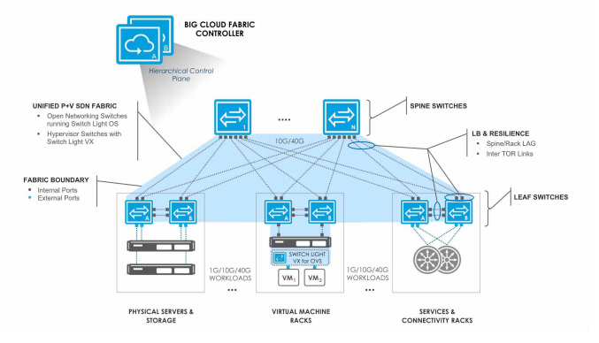

# Big Switch BCF with OpenStack
---

## 概述

### Big Cloud Fabric (BCF)
BCF 是一个开放网络 SDN 数据中心结构，能同时提供基于 VLAN 的物理及虚拟负载的管理 (P+V)，可基于原生的 Neutron ML2 Driver 与 OpenStack 无缝集成。通过在白盒交换机上安装 BCF 网络操作系统，BCF 控制器可实现对于数据中心网络结构的集中式控制；由控制器管理的本地分布式虚拟路由器实现了网络负载的分担；控制器中的 test path 工具可对数据包流经路径进行定位分析；控制器通过和 Neutron 数据库的周期性同步，保证了数据库的一致性。

### BCF 逻辑架构
BCF 是由一套基于 Spine-Leaf 的网络拓扑架构组成的，并且此架构还可被延伸到运行于 Hypervisor 上的虚拟交换机 (IVS)。这些交换设备都是以层级模式部署的，并均由 BCF 控制器统一进行管理，而 OpenStack 则部署于物理服务器上，服务器端的拓扑信息通过 LLDP 来进行收集。通过 Leaf-Spine 间以及 Leaf-Leaf 间的链路聚合连接，确保了整体的可靠性。

## OpenStack 集成 BCF

### 硬件要求
| Hardware Component | Model |
| ------------------ | ----- |
| BCF controller | BCF controller Appliance |
| Fabric Switch: Spine | Dell S4048-ON, Dell S6000-ON, Accton AS6700-32X, Accton AS5710-54X, Accton AS6712-32X, Accton AS5712-54X |
| Fabric Switch: Leaf | Dell S4048-ON, Dell S6000-ON, Accton AS6700-32X, Accton AS5710-54X, Accton AS6712-32X, Accton AS5712-54X |
| Layer 2 switch for p-switch control connectivity | All ports connected to controllers and fabric switches must be in the same VLAN, with IPv6 packets forwarded or flooded in the VLAN. |

### 软件要求
| Software Component | Model |
| ------------------ | ----- |
| BCF controller | Big Cloud Fabric 3.5.0 |
| Fabric Switch: Spine | Switch Light OS SWL-BCF-3.5.0 |
| Fabric Switch: Leaf | Switch Light OS SWL-BCF-3.5.0 |
| Fabric Swtich: vLeaf | Switch Light Virtual BCF-SL-VX-3.5.0 |
| Switch Light Virtual supported OS on compute host | Cent OS 7.1, Ubuntu 14.04 |
| Browser software tested with Big Cloud Fabric GUI | Chrome 37.x   Internet Explorer 10   Safari 7.x   Firefox 32.x |
| OpenStack Release | Kilo |

### 集成
BCF 与 OpenStack 的集成难度相对较低，只需在 OpenStack 控制节点安装 Big Switch OpenStack Installer (BOSI)，并根据需要修改 BOSI 目录下的部署配置文件，通过运行 BOSI 脚本，就可实现与 OpenStack 的集成，以及在各节点中用以提供三层路由功能的 Switch Light Virtual 安装。

## 参考文档
[1] Big Cloud Fabric 3.5.0 User Guide  
[2] Big Cloud Fabric 3.5 Datasheet, 可参见 http://go.bigswitch.com/rs/974-WXR-561/images/0627-47BL_BigSwitch_BCF_3.5_DS_WEB.pdf?_ga=1.70209688.965085565.1456297903  
[3] Big Cloud Fabric Leaf-Spine Clos for Data Centers, 可参见 http://www.slideshare.net/bigswitchnetworks/big-cloud-fabric  
[4] Big Cloud Fabric 3.5.0 Deployment Guide  
[5] UnitedStack有云联合Big Switch、戴尔推出全新云网络解决方案, 可参见 https://www.ustack.com/news/unitedstackbig-switch/
